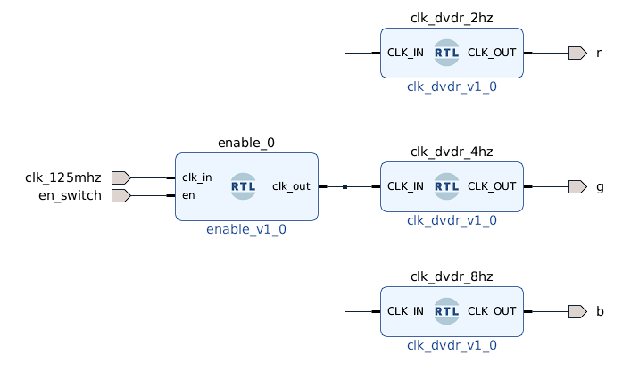

# rgb_clk_dvdr
## Driving RGB LED with ClockDividers

Clock Dividers of 2, 4, 8 Hz connected to r,g,b pins of led. 
There are much simpler ways to change the colors of rgb led in loop with less than 10-15 lines of code in PYNQ framework
why did I do it this way? why not!

## Pin Layout

* r -> AR[0]
* g -> AR[1]
* b -> AR[2]
* en_switch -> SW0
* clk_125mhz -> H16 Pin from Eth PHY

Demo is given Below.

Source is [Linked](https://github.com/ZeroX29a/pynq_clock_Divider_with_sw)
